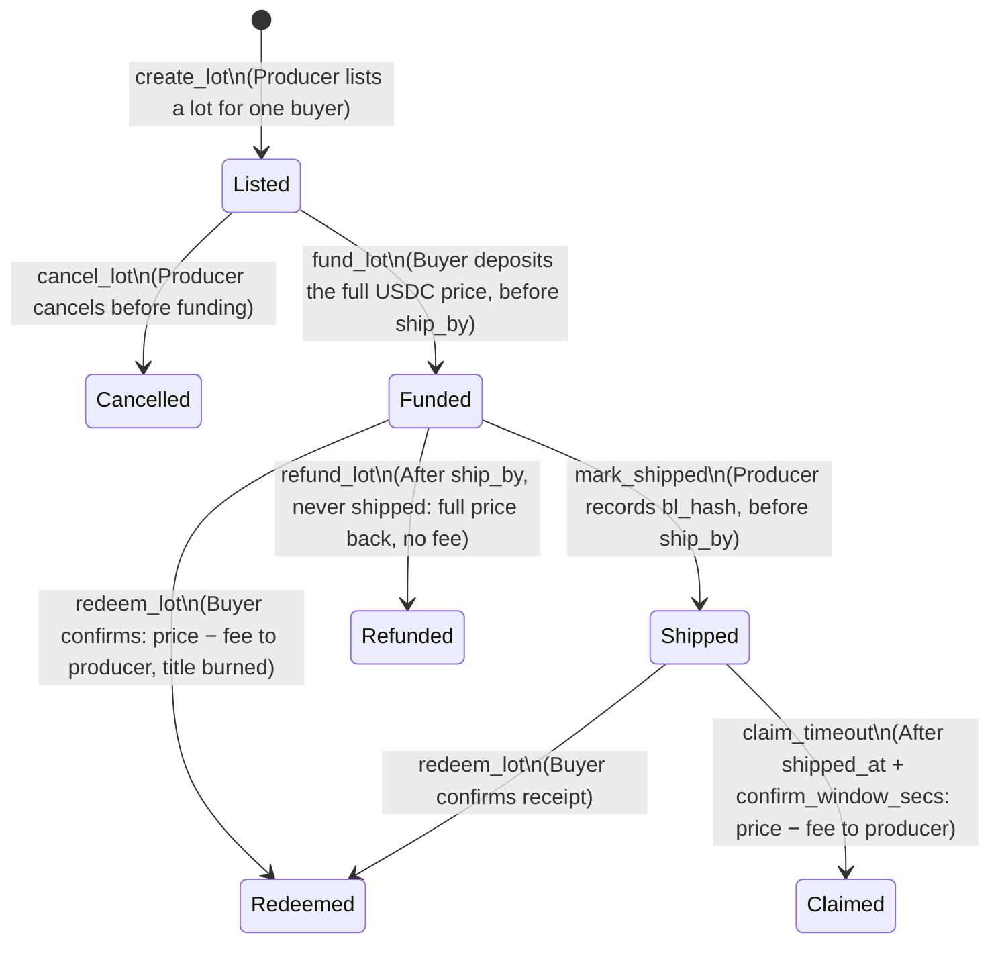

# JuLit

**Safe payments for new lithium companies. A B2B directory and payment escrow for lithium carbonate lots on Solana.**

[](https://explorer.solana.com/address/BntbtLZdHcHTai65uyXpKZyHaqX9kV68ZcfyyLBtXtky?cluster=devnet)
[](https://explorer.solana.com/address/BntbtLZdHcHTai65uyXpKZyHaqX9kV68ZcfyyLBtXtky?cluster=devnet)
[](https://github.com/coral-xyz/anchor)
[](https://nextjs.org/)
[](LICENSE)

The buyer pays only when the lithium arrives, and the producer knows the money is already there. JuLit locks the buyer's USDC in a Solana program and releases it to the producer when the buyer confirms delivery — or refunds the buyer if the lot never ships.

Pitch deck: [`public/pitch-en.html`](public/pitch-en.html) ([PDF](public/pitch-en.pdf)) · Spanish: [`public/pitch.html`](public/pitch.html) · Script: [`public/pitch-script-en.pdf`](public/pitch-script-en.pdf)

---

## 1. The Problem

New lithium producers sell to buyers they don't know.

- **Big players sell to their own partners.** At Cauchari-Olaroz (Jujuy), the owners take the lithium in proportion to their shares.<sup>[1]</sup> There is no trust problem to solve.
- **New players carry the risk.** Argosy Minerals (Salta) sold 20 t of lithium carbonate to a Hong Kong buyer, who paid everything before the ship was loaded.<sup>[2]</sup>
- **Banks leave small companies out.** In 2022, SMEs sent 38% of trade finance requests but received 45% of the rejections.<sup>[3]</sup> A letter of credit is expensive and needs a lot of paperwork.<sup>[4]</sup> Of rejected SMEs that looked for other financing, 40% used their own money<sup>[5]</sup> — with no protection.

---

## 2. Who We Serve

| Segment                    | Fit         | Why                                                                     |
| -------------------------- | ----------- | ----------------------------------------------------------------------- |
| **New producers**          | Yes         | Selling their first lots to buyers who are not partners or shareholders |
| **Small buyers & traders** | Yes         | No bank credit line; today they must pay in advance to get the lithium  |
| **Big integrated groups**  | Not for now | They sell to their own shareholders and already trust their buyer       |

Buyers must operate where stablecoin payments are legal. Mainland China bans them,<sup>[6]</sup> so mainland buyers are out of scope.

---

## 3. The Solution

A payment box that opens only on delivery:

1. **Register** — We (the JuLit admin) register each producer with its production data, like lithium purity. Every lot from that producer uses the same data.
2. **Contract** — Producer and buyer sign a contract in JuLit. The producer creates a lot for that buyer (`create_lot`).
3. **Deposit** — The buyer puts the money, in USDC, into the box (`fund_lot`). The funds sit in a program-owned account and the program only releases them by its rules: to the producer on confirmation or timeout claim, or back to the buyer as a refund. The protocol fee is frozen into the lot at this point.
4. **Delivery** — The producer ships and records the hash of the shipping document on-chain (`mark_shipped`). The lithium arrives, the buyer checks it and confirms (`redeem_lot`). In that same transaction, the producer gets paid.
5. **Fallbacks** — If the producer never ships, the buyer takes a full refund after `ship_by` (`refund_lot`). If the buyer stays silent after shipping, the producer claims the payment once the confirm window expires (`claim_timeout`).

Yes, the buyer pays first. But without a bank, small buyers already pay first. With JuLit, that money is protected.

---

## 4. How It Works On-Chain

Each lot is a Program-Derived Address (PDA) that owns its USDC vault and a Digital Title token (Metaplex). The title never leaves the escrow; it is burned on every terminal transition (`redeem_lot`, `claim_timeout`, `refund_lot`, `cancel_lot`).

### Lifecycle



- `ship_by` (≤ 180 days ahead) and `confirm_window_secs` (60 s – 90 days) are commercial terms fixed at lot creation; the buyer accepts them by funding.
- `bl_hash` is the sha256 of the bill of lading / shipping document, recorded on-chain as shipping evidence.

### Deployed Program (Solana Devnet)

- **Program ID:** [`BntbtLZdHcHTai65uyXpKZyHaqX9kV68ZcfyyLBtXtky`](https://explorer.solana.com/address/BntbtLZdHcHTai65uyXpKZyHaqX9kV68ZcfyyLBtXtky?cluster=devnet)
- **Money:** a project-owned test USDC mint (dUSDC). No real funds.

### On-chain proof (devnet)

Program `BntbtLZdHcHTai65uyXpKZyHaqX9kV68ZcfyyLBtXtky`:

- **TODO:** link a `fund_lot` transaction on Solana Explorer.
- **TODO:** link a `redeem_lot` transaction on Solana Explorer.
- **TODO:** link the live app URL.
- **TODO:** document how to get test dUSDC (see `scripts/seed-devnet.mjs`).

---

## 5. Why Solana

We use Solana because it is fast, and each transaction costs less than one cent.<sup>[7]</sup>

---

## 6. Business Model

We earn only when the payment is released.

- **1% fee**, charged only when the box releases the money to the producer. The fee is capped on-chain at `MAX_FEE_BPS` = 200 (2%); the current rate is 100 bps, stored in `Config` and set by the admin (`set_fee_bps`). The fee is frozen into each lot when the buyer funds it (`lot.fee_bps`), so later admin changes never affect funded lots.
- **Creating a lot and depositing are free.**
- **Why they pay:** the producer ships knowing the money is already locked; the buyer's money is protected until delivery.

We don't replace bank credit. We give a safe option to the companies that can't get it.

---

## 7. Status & Limits

- **Live on Devnet:** the buyer-confirmed flow — list, fund, confirm — has run on Solana Devnet with test money. The version with shipping evidence (`mark_shipped`), `refund_lot` and `claim_timeout` is tested in LiteSVM and pending redeploy. **TODO:** update after redeploy.
- **Tested:** the Anchor program is tested with LiteSVM, and the app with Vitest.

### Known limits

- **Disputes are off-chain.** Quality or quantity disputes are not resolved on-chain: after shipping, the buyer can only confirm or let the confirm window expire. Disputes fall to the off-chain commercial contract; a multisig arbiter (Squads) is on the roadmap.
- **Lot metrics are producer-declared.** Purity, water and carbon metrics and the spec sheet are declared by the producer; the program only range-checks purity. Lab attestation (e.g. Solana Attestation Service) is on the roadmap.
- **`bl_hash` proves commitment, not authenticity.** It proves which shipping document the producer committed to, not that the document is genuine.
- **Test money only.** Settlement uses a project-owned test mint (dUSDC) on devnet; no real funds move. Mainnet would configure Circle USDC in `Config`.
- **Single-key admin today.** Admin, treasury and program upgrade authority are single keys; moving them to a Squads multisig is planned before mainnet. `initialize` is not yet restricted to the upgrade authority (the devnet `Config` is already initialized).
- **Regulatory review pending.** Settlement in USDC must be coordinated with Argentine export FX rules (Decreto 609/2019, BCRA); legal review pending.

---

## 8. The Team

Built in **San Salvador de Jujuy, Argentina**, inside the Lithium Triangle — close to the new producers we want to help.

- **Mauricio Rios** — Team Lead · Solana | [LinkedIn](https://www.linkedin.com/in/rios-mauricio) | [GitHub](https://github.com/RiosMauricio)
- **Mauro Benjamin Mamani** — Frontend | [LinkedIn](https://www.linkedin.com/in/mauromamani/) | [GitHub](https://github.com/mauromamani)
- **Mayko Fernandez** — Protocol · QA | [LinkedIn](https://www.linkedin.com/in/Mayko2003) | [GitHub](https://github.com/Mayko2003)
- **Samuel Paredes** — Full-Stack | [LinkedIn](https://www.linkedin.com/in/samas-dev/) | [GitHub](https://github.com/Samas1503)

---

## 9. Technology Stack

| Layer                   | Technology                                                 |
| ----------------------- | ---------------------------------------------------------- |
| **Smart Contracts**     | Anchor `0.32.1`, Rust 2021, Solana SDK v2                  |
| **Testing**             | LiteSVM (`litesvm 0.7.1`), Vitest (`v3.2.4`)               |
| **Token Standards**     | SPL Token, Metaplex Token Metadata V3                      |
| **Frontend**            | Next.js 16 (App Router), React 19, TypeScript              |
| **Web3 Client**         | `@solana/kit`, Wallet Standard (Phantom, Solflare), Codama |
| **Styling & 3D**        | Tailwind CSS v4, Three.js (`@react-three/fiber`)           |
| **Database & Indexing** | Supabase (PostgreSQL with Row Level Security, Storage)     |

---

## 10. Quickstart

### Prerequisites

- [Node.js](https://nodejs.org/) (v20+) and [pnpm](https://pnpm.io/) (v10+)
- [Rust](https://rustup.rs/) (stable) & [Solana CLI](https://docs.solanalabs.com/cli/install) (v2.0+)
- [Anchor CLI](https://www.anchor-lang.com/docs/installation) (v0.32.1)

### Setup & Run

1. **Clone the repository:**

   ```bash
   git clone https://github.com/YagLab0/julit.git
   cd julit
   ```

2. **Install dependencies:**

   ```bash
   pnpm install
   ```

3. **Configure environment** — create `.env.local` with your Supabase project values:

   ```bash
   NEXT_PUBLIC_SUPABASE_URL=...
   NEXT_PUBLIC_SUPABASE_ANON_KEY=...
   SUPABASE_SECRET_KEY=...
   ```

4. **Run the local development server:**

   ```bash
   pnpm dev
   ```

   Open [http://localhost:3000](http://localhost:3000) for the landing page, or [http://localhost:3000/explorer](http://localhost:3000/explorer) for the producer and lot explorer.

5. **Run the tests:**
   - **App tests (Vitest):**
     ```bash
     pnpm test
     ```
   - **Anchor program tests (LiteSVM):**
     ```bash
     pnpm anchor-test
     ```

---

## 11. Repository Structure

```
├── anchor/
│   ├── programs/julit/src/lib.rs    # Anchor program (escrow, PDAs, Digital Title)
│   └── programs/julit/tests/        # LiteSVM lot lifecycle tests
├── app/
│   ├── explorer/                    # B2B directory, origin map, and lot creation
│   ├── batch/[pda]/                 # Public lot page
│   ├── account/                     # Producer and buyer lot actions
│   ├── api/lots/                    # Lot transitions (fund, redeem, cancel)
│   ├── generated/julit/             # Codama-generated TypeScript client from the Anchor IDL
│   └── landing/                     # Landing page
├── docs/
│   ├── adr/                         # Architectural Decision Records
│   └── features/                    # Feature specifications
├── public/
│   ├── pitch.html                   # Spanish pitch deck
│   ├── pitch-en.html / .pdf         # English pitch deck
│   └── pitch-script-en.html / .pdf  # English pitch script
├── scripts/                         # Devnet and local seeding
└── supabase/
    └── migrations/                  # PostgreSQL schema, RLS policies, and lot indexing
```

---

## 12. Sources

1. Lithium Argentina AG, Exhibit 99.1 filed with the SEC (2026) — Cauchari-Olaroz: 44.8% Lithium Argentina, 46.7% Ganfeng, 8.5% JEMSE; "Both parties are entitled to offtake in proportion to their ownership interests." [sec.gov](https://www.sec.gov/Archives/edgar/data/1440972/000106299326004563/exhibit99-1.htm)
2. Argosy Minerals (ASX: AGY), _Lithium Carbonate Spot Sales Contract_, March 2025 — 20 t to a Hong Kong based chemical company, FOB Buenos Aires, "requiring a 30% deposit and the 70% balance required prior to ship loading". [argosyminerals.com.au](https://www.argosyminerals.com.au/wp-content/uploads/2025/03/2861224.pdf)
3. Asian Development Bank, _2023 Trade Finance Gaps, Growth, and Jobs Survey_ (Brief 256) — in 2022, SMEs submitted 38% of applications and received 45% of rejections. [adb.org](https://www.adb.org/sites/default/files/publication/906596/adb-brief-256-2023-trade-finance-gaps-growth-jobs-survey.pdf)
4. U.S. International Trade Administration, _Letter of Credit_ — "labor-intensive and relatively expensive due to bank fees"; documents "prone to errors and discrepancies". [trade.gov](https://www.trade.gov/letter-credit)
5. Asian Development Bank, _2021 Trade Finance Gaps, Growth, and Jobs Survey_ (Brief 192) — "Among SMEs who were initially rejected and sought alternative financing, 40% used their own funds." [adb.org](https://www.adb.org/sites/default/files/publication/739286/adb-brief-192-trade-finance-gaps-jobs-survey.pdf)
6. People's Bank of China and seven other authorities, Notice Yin Fa [2026] No. 42 (6 February 2026) — virtual currency business activities, including stablecoins, are illegal financial activities in mainland China. [pbc.gov.cn](https://www.pbc.gov.cn/tiaofasi/144941/3581332/2026020619591971323/index.html)
7. Solana Docs, _Fees_ — base fee of 5,000 lamports (0.000005 SOL) per signature; under one US cent at any SOL price below $2,000. [solana.com](https://solana.com/docs/core/fees)
