# JuLit

**B2B Directory & Escrowed Delivery-versus-Payment (DvP) Protocol for Lithium Carbonate Lots on Solana.**

[](https://explorer.solana.com/address/BntbtLZdHcHTai65uyXpKZyHaqX9kV68ZcfyyLBtXtky?cluster=devnet)
[](https://explorer.solana.com/address/BntbtLZdHcHTai65uyXpKZyHaqX9kV68ZcfyyLBtXtky?cluster=devnet)
[](https://github.com/coral-xyz/anchor)
[](https://nextjs.org/)
[](LICENSE)

JuLit eliminates trade finance friction in the global critical minerals market. By combining verifiable plant-level laboratory certifications with programmatic escrow accounts on Solana, JuLit allows lithium carbonate producers and international buyers to execute atomic **Delivery-versus-Payment (DvP)** settlements using USDC—drastically cutting the high fees and settlement delays of traditional bank letters of credit.

---

## 1. The Problem

The global transition to electric mobility relies heavily on **battery-grade lithium carbonate ($Li_2CO_3 \ge 99.50\%$)**. However, cross-border physical transactions between mining producers (e.g., in the South American Lithium Triangle) and international industrial buyers (battery and cathode manufacturers) suffer from two major bottlenecks:

1. **Trade Finance Inefficiency (Letters of Credit):**
   - Traditional bank Letters of Credit (LCs) charge **1.5% to 3.5% in bank commissions** and fees (_Sources: ICC Global Trade Finance Survey, World Bank / IFC Trade Finance Reports_).
   - Bureaucratic verification processes delay capital release by **15 to 45 days**, immobilizing millions of dollars in working capital (_Sources: ICC UCP 600, 60%–70% first-presentation discrepancy rejection rates documented by Trade Finance Global & ICC Trade Register_).
   - Counterparty standoff: Buyers hesitate to pay upfront before delivery, while producers cannot afford to ship multimillion-dollar cargo without guaranteed payment.

2. **Opaque and Fragmented Environmental Evidence:**
   - Critical metrics (chemical purity, water consumption per tonne, carbon emissions) circulate via unlinked PDF files sent over email.
   - Unverifiable paper certificates increase the risk of greenwashing and complicate compliance with strict global standards, such as the upcoming **EU Battery Regulation (Regulation (EU) 2023/1542, Articles 65 & 77)**, which mandates digital battery passports from February 2027.

---

## 2. The Solution

JuLit acts as a B2B directory and on-chain escrow settlement engine:

- **Digital Title in Escrow:** When a producer registers a lot, an immutable **Metaplex NFT** (Digital Title) is minted directly into the lot's Program-Derived Address (PDA) escrow. The token _never leaves the escrow account_, making unauthorized transfers or secondary market speculation impossible by design.
- **Cryptographic Evidence Anchoring:** The SHA-256 digest of the producer's certified plant analysis report is recorded permanently on-chain in the Lot PDA and Metaplex metadata.
- **Escrowed Funding (USDC):** The designated buyer deposits the full lot price into the lot's program-owned USDC token account (`fund_lot`). Funds remain securely locked under smart contract custody.
- **Atomic Delivery-versus-Payment (DvP):** Upon physical receipt and inspection of the cargo at the facility, the buyer signs `redeem_lot`. In a single atomic transaction, the Digital Title is burned inside escrow and the deposited USDC is released to the producer (minus the protocol take rate).
- **Built-in Safety Mechanisms:**
  - **Claim Timeout (`claim_timeout`):** If an unresponsive buyer fails to redeem after the designated `claimable_after` window, the producer can unilaterally claim the escrowed funds.

---

## 3. On-Chain Architecture & Lifecycle

All state transitions are enforced by the JuLit Anchor program on Solana:

```mermaid
stateDiagram-v2
    [*] --> Listed: create_lot\n(Mints Digital Title into Escrow PDA)
    Listed --> Cancelled: cancel_lot\n(Producer cancels before funding; burns NFT)
    Listed --> Funded: fund_lot\n(Buyer deposits full USDC price into Escrow PDA)
    Funded --> Redeemed: redeem_lot\n(Buyer confirms physical receipt: burns NFT, releases USDC)
    Disputed --> Redeemed: redeem_lot\n(Legacy disputed lots resolve in the producer's favour)
    Funded --> Claimed: claim_timeout\n(Window expires without buyer action: burns NFT, releases USDC)
```



### Deployed Program (Solana Devnet)

- **Program ID:** [`BntbtLZdHcHTai65uyXpKZyHaqX9kV68ZcfyyLBtXtky`](https://explorer.solana.com/address/BntbtLZdHcHTai65uyXpKZyHaqX9kV68ZcfyyLBtXtky?cluster=devnet)
- **Devnet Mint (dUSDC):** Compatible with project-seeded test USDC mint for deterministic end-to-end testing.

---

## 4. Why Solana?

- **Sub-Second Finality & Low Transaction Costs:** Moving physical commodity settlement on-chain requires atomic multi-instruction transactions (token burning, split payments to producer and treasury) that cost a fraction of a cent and execute in under 1 second.
- **Program Derived Addresses (PDAs) as Autonomous Escrows:** JuLit eliminates human custodians. The `Lot PDA` autonomously owns the token vault and controls token burning and fund distribution strictly via `invoke_signed`.
- **Standard Compatibility:** Built using the standard SPL Token program, Metaplex Token Metadata V3, and Anchor 0.32.1.

---

## 5. Trust Model & Oracle Boundaries

We maintain strict honesty about the boundaries of blockchain verification:

- **What on-chain hashing proves:** Recording the SHA-256 hash of a plant analysis PDF on-chain guarantees that the certificate has not been modified, replaced, or tampered with since the lot was listed.
- **What on-chain hashing does not prove:** It does _not_ prove physical chemical reality or sample chain-of-custody. JuLit does not replace licensed assayers or chemical laboratories. Instead, certified plant documents are legally tied to registered producer entities, making fraudulent declarations legally auditable.
- **Admissibility criteria:** Only lots meeting **Battery Grade** ($\ge 99.50\%$ purity) with positive volume and valid origin IDs are permitted on-chain.

---

## 6. Business Model & Unit Economics

JuLit charges an on-chain **Take Rate** (in basis points) exclusively upon successful settlement:

- **Fee Structure:** Deduces a small protocol fee from the escrow release when `redeem_lot` or `claim_timeout` executes, routing it directly to the protocol treasury ATA.
- **Zero Pre-Execution Cost:** Listing a lot (`create_lot`) and depositing funds (`fund_lot`) incur no protocol fees.
- **Cost Comparison vs. Letters of Credit:**
  - **Traditional LC:** A typical 50-tonne spot shipment (~$1,000,000 USD) costs **$15,000 to $35,000 USD** in banking commissions plus 30+ days of illiquidity (_Benchmark: Fastmarkets / S&P Global Platts lithium spot pricing & ICC banking fees_).
  - **JuLit Escrow:** Programmatic fee of **0.50% to 1.00%** ($5,000 to $10,000 USD) with instantaneous fund release upon delivery confirmation, yielding significant savings and unlocking cash flow.

---

## 7. The Team & Regional Edge

JuLit is built by a team based in **San Salvador de Jujuy, Argentina**, located directly in the heart of the South American **Lithium Triangle** (Jujuy, Salta, and Catamarca):

- **Mauricio Rios** — Team Lead & Smart Contract Engineer | [LinkedIn](https://www.linkedin.com/in/rios-mauricio) | [GitHub](https://github.com/RiosMauricio)
- **Samuel Paredes** — Full-Stack Developer & Backend Integration | [LinkedIn](https://www.linkedin.com/in/samas-dev/) | [GitHub](https://github.com/Samas1503)
- **Mauro Benjamin Mamani** — Frontend & Design Engineer | [LinkedIn](https://www.linkedin.com/in/mauromamani/) | [GitHub](https://github.com/mauromamani)
- **Mayko Fernandez** — Protocol & QA Engineer | [LinkedIn](https://www.linkedin.com/in/Mayko2003) | [GitHub](https://github.com/Mayko2003)

Our regional presence provides direct access to regional mining facilities, local testing laboratories, and provincial chambers of commerce.

---

## 8. Technology Stack

| Layer                   | Technology                                                 |
| ----------------------- | ---------------------------------------------------------- |
| **Smart Contracts**     | Anchor `0.32.1`, Rust 2021, Solana SDK v2                  |
| **Testing**             | LiteSVM (`litesvm 0.7.1`), Vitest (`v3.2.4`)               |
| **Token Standards**     | SPL Token, Metaplex Token Metadata V3                      |
| **Frontend**            | Next.js 16 (App Router), React 19, TypeScript              |
| **Web3 Client**         | `@solana/kit`, Wallet Standard (Phantom, Solflare), Codama |
| **Styling & 3D**        | Tailwind CSS v4, Three.js (`@react-three/fiber`)           |
| **Database & Indexing** | Supabase (PostgreSQL with Row Level Security, Storage)     |

---

## 9. Quickstart: Running in < 5 Minutes

### Prerequisites

- [Node.js](https://nodejs.org/) (v20+) and [pnpm](https://pnpm.io/) (v10+)
- [Rust](https://rustup.rs/) (stable) & [Solana CLI](https://docs.solanalabs.com/cli/install) (v2.0+)
- [Anchor CLI](https://www.anchor-lang.com/docs/installation) (v0.32.1)

### Setup & Run

1. **Clone the repository:**

   ```bash
   git clone https://github.com/YagLab0/julit.git
   cd julit
   ```

2. **Install dependencies:**

   ```bash
   pnpm install
   ```

3. **Configure environment:**

   ```bash
   cp .env.example .env.local
   # Fill in your Supabase Devnet credentials
   ```

4. **Run the local development server:**

   ```bash
   pnpm dev
   ```

   Open [http://localhost:3000](http://localhost:3000) for the public landing page, or [http://localhost:3000/explorer](http://localhost:3000/explorer) for the Origin & Lot Explorer.

5. **Run the test suite:**
   - **Full-stack API & verification tests (104 tests):**
     ```bash
     pnpm test
     ```
   - **Anchor program tests (LiteSVM):**
     ```bash
     cd anchor && cargo test
     ```

---

## 10. Repository Structure

```
├── anchor/
│   ├── programs/julit/src/lib.rs    # Anchor smart contract (Escrow DvP, PDAs, Metaplex CPIs)
│   └── tests/lot_lifecycle.rs       # LiteSVM integration tests for lot lifecycle
├── app/
│   ├── explorer/                    # B2B lot catalogue, origin map, and lot creation
│   ├── batch/[pda]/                 # Public digital passport and PDF hash verification
│   ├── api/lots/                    # API route handlers for on-chain transitions (fund, redeem, dispute)
│   ├── generated/julit/             # Codama-generated TypeScript client from Anchor IDL
│   ├── landing/                     # Landing page components, motion, and process widgets
│   ├── layout.tsx & page.tsx        # Next.js 16 root shell and public landing
├── docs/
│   ├── adr/                         # Architectural Decision Records (ADR-0019 Escrow DvP)
│   └── features/                    # Feature specifications
├── public/
│   ├── pitch.html                   # Interactive Spanish pitch deck
│   ├── pitch-en.html                # Interactive English pitch deck
│   └── landing/                     # Optimized visual assets and photography
└── supabase/
    └── migrations/                  # PostgreSQL schemas, RLS policies, and lot indexing
```

---

## 11. Public Reports & Authoritative Sources

| Area                                  | Institution / Report                                                                                                       | Key Citation & Metric                                                                                                                                                                                                     |
| :------------------------------------ | :------------------------------------------------------------------------------------------------------------------------- | :------------------------------------------------------------------------------------------------------------------------------------------------------------------------------------------------------------------------ |
| **Lithium Market Growth**             | **McKinsey & Company** (_Lithium mining: How new supply is answering battery demand_) & **Benchmark Mineral Intelligence** | Projections forecast the battery value chain exceeding **$150B–$400B by 2030**, requiring over $50B in capital investments for mines and refining capacity.                                                               |
| **Letters of Credit Costs**           | **International Chamber of Commerce (ICC)** (_Global Survey on Trade Finance_) & **World Bank / IFC**                      | All-in banking costs for commercial documentary letters of credit in emerging market corridors (including Latin America) average **1.5% to 3.5%** across issuance (0.5%–1.5%) and international confirmation (1.0%–2.5%). |
| **Settlement Delays & Discrepancies** | **ICC UCP 600 Rules** & **Trade Finance Global (TFG)**                                                                     | **60% to 70%** of initial document presentations face discrepancy rejections under documentary credits, prolonging the settlement and payment turnaround cycle to **15 to 45 days**.                                      |
| **Mandatory Battery Passport**        | **European Union (EUR-Lex / OJEU)** (_Regulation (EU) 2023/1542, Articles 65 & 77_)                                        | Enforces a mandatory Digital Battery Passport with certified raw material provenance and carbon footprint accounting effective **February 18, 2027**.                                                                     |
| **Lithium Reserves Concentration**    | **U.S. Geological Survey (USGS)** (_Mineral Commodity Summaries_)                                                          | The South American **Lithium Triangle** (Argentina, Bolivia, and Chile) accounts for over **53% of global identified lithium resources**.                                                                                 |
